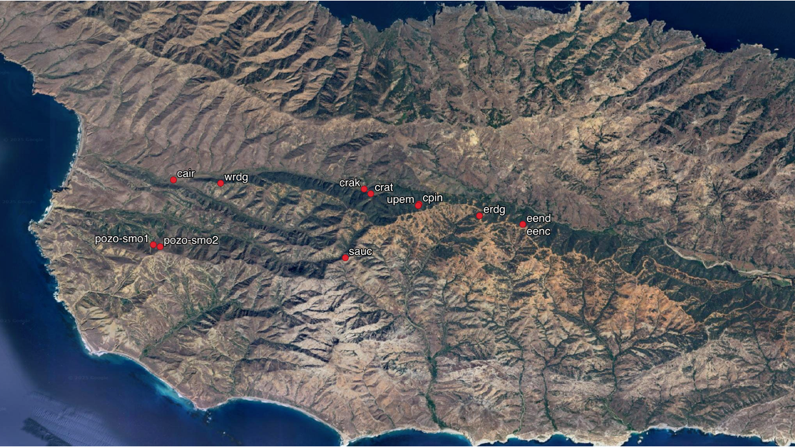

# Santa Cruz Island Fog Analysis

This repository hosts analyses related to fog on Santa Cruz Island. An important but understudied component of the climate, fog is critical to the survival of several island endemics such Bishop Pine. As such, this body of work strives to understand fog dynamics at the island, including: differences between microclimates, trends in fog and low clouds over time, and whether we can infer fog presence based only on standard weather station parameters. 

__Figure 1:__ Santa Cruz Island Weather Station Locations. 

# Highlighted Notebooks
__[Santa Cruz Island Weather Data EDA](./notebooks/02-analyses/eda-sci-weather.ipynb)__   
We have aggregated data from a transect of weather stations across the island, many of which were provided by Chris Still. This notebook explores that data, including date ranges covered by site, typical weather conditions, intersite comparisons of fog drip, and temporal trends in fog drip. 

__[GOES Coastal Low Clouds vs. Site Fog Drip](./notebooks/02-analyses/goes-fog-drip-comparisons)__   
Using a dataset comprised of 1km scaled, half-hourly observations of coastal low clouds derived from GOES satellite data (Clemesha, 2021), we assess the relationship between fog drip and low clouds, with the aim being to assess how frequently fog conditions occur during low cloud events. Applications of this include inferring trends in fog based on satellite-derived records of trends in low clouds as well as informing ecohydrological models, where fog may not be fully represented. 

A caveat to this analysis is that fog most often occurs at night, but the GOES dataset is only for daylight hours - so the analysis is only valid for daylight hours. However, daytime fog is ecologically relevant as it mitigates evapotranspiration during the hottest times of the year. 

_Clemesha, R. E, et al. (2021). A high-resolution record of coastal clouds and fog and their role in plant distributions over San Clemente Island, California. Environmental Research Communications, 3(10), 105003.
DOI 10.1088/2515-7620/ac2894_

## To Do: 
- Create single preprocessing script for weather station data - currently using notebooks which aren't ideal.
- Update README with background on SCI fog + add figures. 